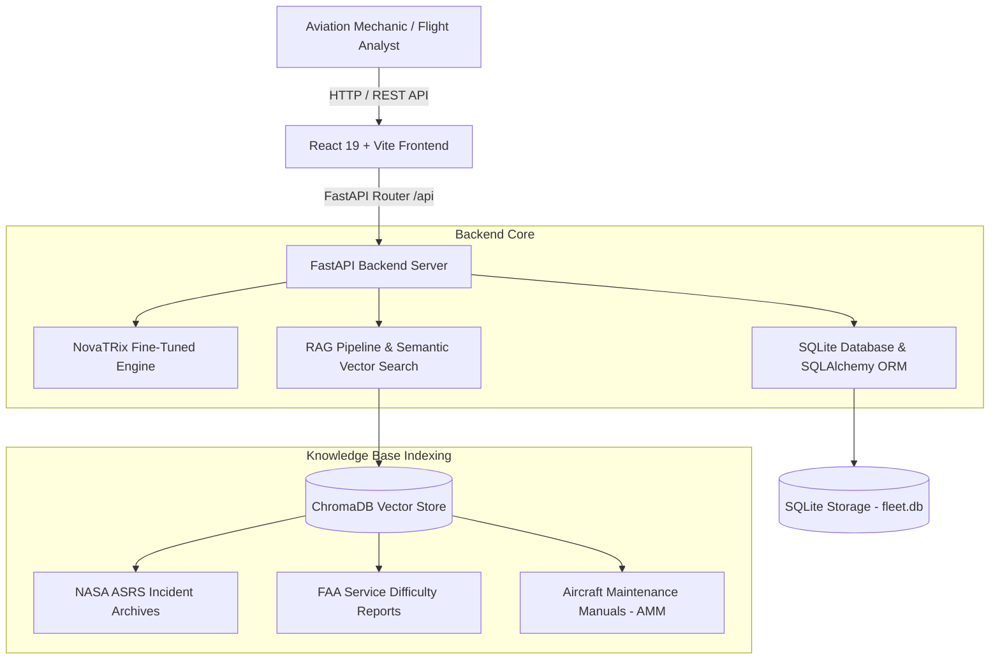

# AeroLLM ✈️ — Aviation Maintenance & Safety AI Copilot

[](https://www.python.org/)
[](https://fastapi.tiangolo.com/)
[](https://react.dev/)
[](https://vitejs.dev/)
[](LICENSE)

> **Domain-Specific RAG Engine & AI Copilot Platform for Commercial Aviation Maintenance Engineering and Flight Safety Operations.**

---

## 🌟 Overview

**AeroLLM** is an enterprise-grade aviation AI intelligence platform engineered specifically for airlines, MRO (Maintenance, Repair, and Overhaul) facilities, flight safety analysts, and line maintenance engineers. Powered by **NovaTRix** (a fine-tuned aviation domain LLM) and an integrated **Retrieval-Augmented Generation (RAG)** vector engine, AeroLLM converts unstructured technician narratives into structured ATA 100 fault classifications, component replacement recommendations, and airworthiness risk assessments in real-time.

---

## ✨ Key Features

- 🧠 **NovaTRix RAG Engine**: Combines domain-tailored LLM context grounding with ChromaDB vector search against indexed Aircraft Maintenance Manuals (AMM), NASA ASRS incident archives, and FAA Service Difficulty Reports.
- 📊 **Operations Command Center Dashboard**: Real-time fleet metrics, airworthiness availability tracking, maintenance action distributions, and active fault radars.
- 🛩️ **Interactive Fleet Directory**: Airframe tracking with status pills (`AIRWORTHY`, `MAINTENANCE`, `INSPECTION`), tail ID filtering, and detailed maintenance history drawers.
- 🔍 **Real-Time Fault Diagnostics**: Severity classification (`CRITICAL`, `MAJOR`, `MINOR`), candidate inspection area mapping, and ATA chapter resolution flows.
- 📜 **Historical Logbook Audit**: Searchable SQLite database logbook for tracking historical maintenance actions, component replacements, and technician notes.
- 🔎 **Global Aviation Search (Ctrl+K)**: Instant search modal across aircraft tail numbers, fault codes, narratives, and maintenance logs.
- 💎 **Modern Light-Glass UI/UX**: Fluid glassmorphism interface built with vibrant brand gradients, responsive light beams, and interactive data visualizations.

---

## 🏗️ System Architecture



---

## 💻 Tech Stack

### Frontend
- **Framework**: React 19 + Vite 8
- **Styling**: Vanilla CSS3 + TailwindCSS (Glassmorphic Token System)
- **Icons**: Lucide React (`lucide-react`)
- **Animations**: CSS Keyframe Orbs, Video Light Beams, Smooth Micro-transitions

### Backend & AI Engine
- **Web Framework**: FastAPI + Uvicorn
- **ORM / Database**: SQLAlchemy + SQLite Persistent Storage
- **RAG & Vector Database**: ChromaDB + Sentence Transformers / HuggingFace Embeddings
- **Validation**: Pydantic v2

---

## 📁 Repository Structure

```
AeroLLM-Backend/
├── main.py                        # FastAPI entry point & startup RAG initialization
├── requirements.txt               # Python backend dependencies
├── README.md                      # Comprehensive project documentation
├── database/
│   └── session.py                 # SQLite database engine & SessionLocal ORM setup
├── models/                        # SQLAlchemy database models
│   ├── aircraft.py                # Aircraft fleet schema
│   ├── maintenance.py             # Maintenance log record schema
│   └── fault.py                   # Fault telemetry schema
├── routes/                        # FastAPI REST API endpoints
│   ├── health.py                  # System health & backend status
│   ├── aircraft.py                # Fleet CRUD endpoints
│   ├── maintenance.py             # Logbook records & submission endpoints
│   ├── faults.py                  # Fault telemetry & issue tracking
│   ├── dashboard.py               # Aggregated KPI & metrics endpoints
│   ├── search.py                  # Global keyword search endpoint
│   ├── reports.py                 # Comprehensive report generation
│   └── rag.py                     # RAG query & analysis endpoint
├── services/                      # Core business logic & AI pipelines
│   ├── novatrix.py                # NovaTRix AI inference & entity extractor
│   ├── rag_pipeline.py            # ChromaDB vector indexing & passage retrieval
│   └── seed.py                    # Fleet & initial maintenance demo seeder
├── data/                          # Aviation knowledge base dataset
│   ├── raw/                       # Raw Aircraft Maintenance Manuals (AMM text files)
│   └── chroma/                    # ChromaDB vector database index directory
└── frontend/                      # React + Vite web application
    ├── index.html                 # App entry HTML template
    ├── package.json               # Frontend dependencies & scripts
    ├── vite.config.js             # Vite bundler configuration
    ├── public/                    # Static media assets (videos & light beam images)
    └── src/
        ├── App.jsx                # Main application component & tab router
        ├── index.css              # Global CSS design system & glass tokens
        ├── components/
        │   ├── common/            # StatCard & metrics widgets
        │   ├── glass/             # GlassCard & SearchModal components
        │   └── layout/            # Navbar & Footer components
        ├── pages/
        │   ├── Home/              # Hero banner, features, CTA section
        │   ├── Dashboard/         # Operations Command Center
        │   ├── Aircraft/          # Airframe directory & drawer modal
        │   ├── Faults/            # Diagnostics & hazard radar
        │   ├── History/           # Logbook audit table & detail modal
        │   ├── TryAeroLLM/        # Interactive RAG Copilot workstation
        │   ├── Capabilities/      # Engine specifications & feature cards
        │   ├── UseCases/          # Industry workflow scenarios
        │   ├── Dataset/           # Corpus sources & visual ETL pipeline
        │   └── About/             # Technology architecture flow
        └── services/
            └── api.js             # Frontend API client service
```

---

## ⚡ Quick Start Guide

### Prerequisites
- **Python**: 3.10 or higher
- **Node.js**: 18.0 or higher
- **npm**: 9.0 or higher

---

### 1. Backend Setup

1. **Clone the repository**:
   ```bash
   git clone https://github.com/NAWAS-SHERIF-S/aerollm_rev2.git
   cd aerollm_rev2
   ```

2. **Create and activate a Virtual Environment**:
   ```bash
   # Windows (PowerShell)
   python -m venv venv
   .\venv\Scripts\Activate.ps1

   # Linux / macOS
   python3 -m venv venv
   source venv/bin/activate
   ```

3. **Install Python dependencies**:
   ```bash
   pip install -r requirements.txt
   ```

4. **Start the FastAPI Backend Server**:
   ```bash
   python main.py
   ```
   > The backend server will automatically seed initial demo data and initialize the ChromaDB vector index at `http://localhost:8000`.  
   > Interactive API Swagger Documentation is available at `http://localhost:8000/docs`.

---

### 2. Frontend Setup

1. **Navigate to the frontend directory**:
   ```bash
   cd frontend
   ```

2. **Install Node.js dependencies**:
   ```bash
   npm install
   ```

3. **Start the Vite Development Server**:
   ```bash
   npm run dev
   ```
   > The web application will launch at **[http://localhost:5174/](http://localhost:5174/)** (or `http://localhost:5173/`).

---

## 🔌 API Endpoint Reference

| Method | Endpoint | Description |
| :--- | :--- | :--- |
| `GET` | `/` | API status check & service metadata |
| `GET` | `/api/health` | System health check (RAG & DB status) |
| `GET` | `/api/dashboard/stats` | Aggregated fleet stats, actions distribution, & counts |
| `GET` | `/api/aircraft` | List all fleet aircraft with flight status |
| `GET` | `/api/aircraft/{id}/maintenance` | Fetch maintenance logs for specific tail ID |
| `GET` | `/api/maintenance` | Retrieve all historical maintenance log entries |
| `POST` | `/api/maintenance` | Submit new maintenance log narrative |
| `GET` | `/api/faults` | Fetch active fault telemetry & issue list |
| `POST` | `/api/rag/analyze` | Execute NovaTRix RAG pipeline on technician report |
| `GET` | `/api/search` | Global keyword search across aircraft, logs, and faults |

---

## 🛡️ Decision Support & Compliance Disclaimer

> **IMPORTANT**: AeroLLM and NovaTRix provide source-backed artificial intelligence decision support. Retrieved references and AI predictions must be verified against the applicable approved Aircraft Maintenance Manual (AMM), OEM directives, operator procedures, and authorized engineering personnel before performing physical maintenance actions.

---

## 📄 License

This project is licensed under the [MIT License](LICENSE).

---

## 🤝 Acknowledgments & Data Sources

- **FAA**: Federal Aviation Administration Service Difficulty Reports (SDR) & Advisory Circulars (AC).
- **NASA ASRS**: National Aeronautics and Space Administration Aviation Safety Reporting System.
- **NTSB**: National Transportation Safety Board incident investigation records.
